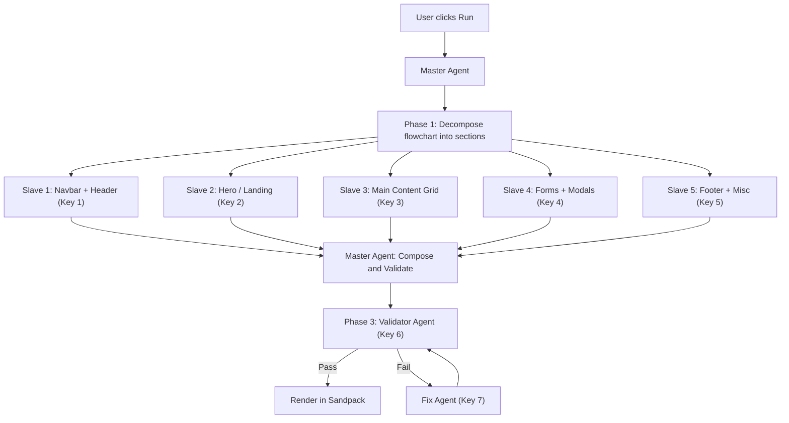

# Plan v2: Master-Slave Agentic App Generation

## Problem Statement

The current `generateAppBoilerplate` function sends the **entire flowchart** to a **single Gemini API call** and asks it to produce a complete React component in one shot. This causes:

1. **Token overflow** — Complex flowcharts with 8-12 nodes produce 400-600 line components. The model frequently hits output token limits, producing truncated code with unterminated strings, missing closing braces, and orphaned `try` blocks.
2. **Syntax errors** — A single monolithic generation has no self-correction. If the model makes one mistake on line 26, lines 27-500 are all broken.
3. **Rate limiting** — One key gets hammered; the current 2-key rotation is insufficient for the heavy prompt.
4. **No parallelism** — Generation is serial. The user waits 15-30 seconds for a single blocking call.

## Available Resources

| Resource | Count | Env Var Pattern |
|----------|-------|-----------------|
| Google/Gemini API Keys | 12 | `GOOGLE_API_KEY_1` through `GOOGLE_API_KEY_12` |
| Groq API Keys | 10 | `GROQ_API_KEY_1` through `GROQ_API_KEY_10` |
| Legacy Gemini Keys | 2 | `GEMINI_API_KEY`, `GOOGLE_API_KEY` |

**Total usable keys: 14 Gemini + 10 Groq = 24 keys**

---

## Architecture: Master-Slave Agentic Model



### Phase 1 — Master: Decompose (1 API call, ~500 tokens out)

The **Master Agent** receives the TOON flowchart and produces a **Component Blueprint** — a JSON plan that splits the app into 3-6 independent sections based on the node graph topology.

**Input**: Full TOON string  
**Output**: JSON blueprint

```json
{
  "appName": "Portfolio Website",
  "sections": [
    {
      "id": "navbar",
      "label": "Navigation Bar",
      "nodes": ["node-1"],
      "description": "Sticky glassmorphism navbar with logo, 4 nav links, and CTA button",
      "dependsOn": []
    },
    {
      "id": "hero",
      "label": "Hero Section",
      "nodes": ["node-2", "node-3"],
      "description": "Full-width hero with gradient background, h1 heading, subtitle, two CTA buttons, and abstract tech image",
      "dependsOn": ["navbar"]
    },
    {
      "id": "content",
      "label": "Project Gallery",
      "nodes": ["node-4", "node-5", "node-6"],
      "description": "Bento grid of 4 project cards with images, titles, and hover animations",
      "dependsOn": []
    },
    {
      "id": "forms",
      "label": "Contact Form",
      "nodes": ["node-7"],
      "description": "Contact form with name, email, message fields. Submit via postMessage bridge.",
      "dependsOn": []
    },
    {
      "id": "footer",
      "label": "Footer",
      "nodes": ["node-8"],
      "description": "Dark footer with 3-column links, social icons, copyright",
      "dependsOn": []
    }
  ],
  "sharedState": ["currentPage", "isDark", "isMenuOpen"],
  "sharedTypes": ["interface NavItem { label: string; href: string; }"]
}
```

**Key design choice**: The Master prompt is lightweight (~800 tokens output) so it never truncates. It uses `GOOGLE_API_KEY_1` (dedicated).

---

### Phase 2 — Slaves: Generate Sections in Parallel (N API calls, concurrent)

Each section from the blueprint is sent to a **different Gemini API key** simultaneously using `Promise.allSettled()`.

Each Slave receives:
- The section's description and relevant node descriptions
- The shared state/types from the blueprint
- A strict contract: return a **named function component** (not `export default`)

**Slave prompt contract**:
```
Generate a React component function called "${sectionId}Section" that renders: ${description}.

Rules:
- Return ONLY a function component. NOT export default.
- Signature: const ${SectionName}Section = () => { ... }
- Use only: React, useState, useEffect, lucide-react, framer-motion, Tailwind CSS.
- Do NOT import external components. Define sub-components inline.
- Maximum 80 lines of JSX. Be concise.
```

**Key assignment strategy** (round-robin across 12 keys):

| Slave | Section | API Key |
|-------|---------|---------|
| Slave 1 | navbar | `GOOGLE_API_KEY_2` |
| Slave 2 | hero | `GOOGLE_API_KEY_3` |
| Slave 3 | content | `GOOGLE_API_KEY_4` |
| Slave 4 | forms | `GOOGLE_API_KEY_5` |
| Slave 5 | footer | `GOOGLE_API_KEY_6` |

> [!IMPORTANT]
> Each slave generates **at most 80-120 lines** instead of 500+. This virtually eliminates token truncation.

---

### Phase 3 — Master: Compose (deterministic template, zero AI calls)

The Master takes all section outputs and assembles them into a single `App.tsx` file using a **deterministic template** (no AI needed for this step):

```tsx
import React, { useState, useEffect } from "react";
import { motion, AnimatePresence } from "framer-motion";
// ... lucide imports extracted from sections

// ---- SECTION: Navbar ----
${navbarCode}

// ---- SECTION: Hero ----
${heroCode}

// ---- SECTION: Content ----
${contentCode}

// ---- SECTION: Forms ----
${formsCode}

// ---- SECTION: Footer ----
${footerCode}

// ---- APP SHELL ----
export default function App() {
  const [currentPage, setCurrentPage] = useState("home");
  const [isDark, setIsDark] = useState(false);

  return (
    <div className="min-h-screen bg-white text-slate-900 font-sans">
      <NavbarSection />
      <HeroSection />
      <ContentSection />
      <FormsSection />
      <FooterSection />
    </div>
  );
}
```

This step is **pure string concatenation + template** — zero AI calls, zero risk of syntax errors.

---

### Phase 4 — Validator Agent: Syntax Check (1 API call)

Before rendering in Sandpack, run a **lightweight validation pass**:

1. **Static check** (no AI): Parse with a simple brace/bracket counter to catch obvious truncation.
2. **AI Validator** (1 call, `GOOGLE_API_KEY_7`): Ask the model to check the composed code for syntax issues and fix them. Prompt:

```
Review this React component for syntax errors only. If there are errors,
return the FIXED code. If it is valid, return it unchanged.
Return ONLY code, no commentary.
```

If validation fails after 2 retries, fall back to the current single-shot approach as a safety net.

---

## File Changes

### [NEW] `lib/gemini-pool.ts`
**Key Pool Manager** — loads all 12+ Google API keys from env, provides `getNextKey()` with round-robin, tracks per-key rate limit state, and exposes `callWithKey(keyIndex, prompt)` for directed calls.

### [NEW] `lib/master-agent.ts`
**Master Agent** — contains:
- `decomposeFlowchart(toonData)` - calls Phase 1 decomposition
- `composeSections(blueprint, sectionResults)` - deterministic template assembly
- `validateAndFix(composedCode)` - Phase 4 validation loop

### [NEW] `lib/slave-agent.ts`
**Slave Agent** — contains:
- `generateSection(sectionBlueprint, keyIndex)` - generates a single section component
- Section-specific prompt templates (navbar, hero, content, forms, footer)

### [MODIFY] [ai.ts](file:///d:/coding_files/Projects/AvtarFlowXXX/app/actions/ai.ts)
- Replace `generateAppBoilerplate` implementation to call the new master-slave pipeline
- Keep the same function signature so `EditorShell.tsx` doesn't change
- Fallback: if master-slave fails, retry with legacy single-shot

### [MODIFY] [gemini-client.ts](file:///d:/coding_files/Projects/AvtarFlowXXX/lib/gemini-client.ts)
- Update `getApiKeys()` to load `GOOGLE_API_KEY_1` through `GOOGLE_API_KEY_12`
- Increase `maxRetries` default from 3 to 12

### [MODIFY] [PreviewPane.tsx](file:///d:/coding_files/Projects/AvtarFlowXXX/components/paint/PreviewPane.tsx)
- Keep `sanitizeCodeForPreview` as a final safety net
- Add import deduplication (merge duplicate React imports from multiple sections)

---

## Execution Timeline

```
User clicks "Run"
    |
    +-- 0ms:    Master: decompose (1 call, ~2s)
    |
    +-- 2000ms: Slaves: generate 5 sections in parallel (~4-6s)
    |           +-- Slave 1 -> Key 2 (navbar)
    |           +-- Slave 2 -> Key 3 (hero)
    |           +-- Slave 3 -> Key 4 (content)
    |           +-- Slave 4 -> Key 5 (forms)
    |           +-- Slave 5 -> Key 6 (footer)
    |
    +-- 8000ms: Master: compose (0ms, template)
    |
    +-- 8000ms: Validator: check + fix (1 call, ~2s)
    |
    +-- 10000ms: Render in Sandpack
```

**Total: ~10 seconds** (down from 15-30 seconds, with dramatically fewer errors)

---

## Error Handling Strategy

| Failure | Recovery |
|---------|----------|
| Slave returns empty/error | Retry that slave with next available key |
| Slave returns truncated code | Validator catches and requests fix from Fix Agent |
| Master decomposition fails | Fall back to legacy single-shot `generateAppBoilerplate` |
| All keys rate-limited | Queue with exponential backoff, show "Rate limited, retrying..." in UI |
| Validator loop exceeds 3 attempts | Render best-effort code with console warning |

---

## UI Changes for Thinking Loop

Update the `GENERATING_STEPS` in [AIChatPanel.tsx](file:///d:/coding_files/Projects/AvtarFlowXXX/components/paint/AIChatPanel.tsx) to reflect the real pipeline stages:

```typescript
const GENERATING_STEPS = [
    "Analyzing flowchart structure...",
    "Decomposing into component sections...",
    "Generating Navbar and Header...",
    "Generating Hero section...",
    "Generating Content grid...",
    "Generating Forms and interactions...",
    "Generating Footer...",
    "Assembling components...",
    "Validating syntax...",
    "Polishing final output..."
];
```

---

## Open Questions

> [!IMPORTANT]
> **Groq keys**: You have 10 Groq API keys. Groq runs Llama/Mixtral models which are fast but less capable at React/TSX generation. Options:
> 1. Use Groq only for the lightweight Phase 1 decomposition (saves Gemini keys for generation)
> 2. Use Groq as fallback validators
> 3. Do not use Groq at all (stick with Gemini for quality)
>
> **Which approach do you prefer?**

> [!IMPORTANT]
> **Section granularity**: Should the Master decompose into 3-4 large sections (fewer API calls, slightly larger per-section output) or 6-8 fine-grained sections (more calls but safer per-section)? The sweet spot is probably **4-5 sections** matching a typical page layout.

## Verification Plan

### Automated Tests
- Test `decomposeFlowchart` with 3 sample TOON strings (portfolio, e-commerce, SaaS dashboard)
- Test `composeSections` with mock section outputs to verify template assembly
- Run `npm run build` after all changes

### Manual Verification
- Generate apps from all 5 workflow template categories in the Workflow Builder
- Verify each renders in Sandpack without "Something went wrong" errors
- Time the generation pipeline end-to-end (target: less than 12 seconds)
